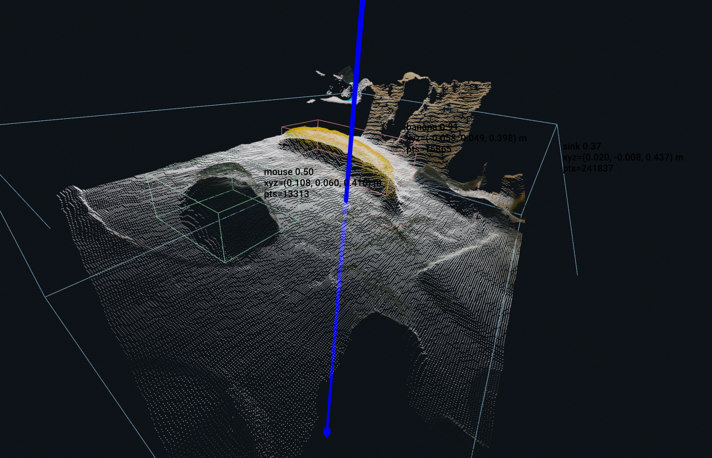

# TabletopSeg3D

English documentation: [README.md](./README.md)

基于 `Intel RealSense + YOLO Segmentation + Open3D` 的实时桌面目标三维检测工程。



功能：

- 实时 Open3D 场景显示
- `headless` 无界面 JSON 输出

系统特性：

- 单相机实时运行，支持 `realsense` 系列相机，目前在 `D435I`、`D405` 上经过测试
- YOLO 实例分割
- 深度回投到点云
- 桌面对齐 OBB
  - 框的 `Z` 方向跟随桌面法向
  - 只输出 1 个旋转自由度 `yaw`
- 可选 Open3D 3D 标注
- `--no-display` 时输出每帧 JSON，包含：
  - 物体类别
  - 相机坐标系中心点
  - 物体尺寸
  - 框旋转角 `yaw`

## 目录

```text
perception/tabletopseg3d/
├── README.md
├── README_cn.md
├── licenses/
│   └── ULTRALYTICS_YOLO11_NOTICE.md
├── requirements.txt
├── scripts/
│   └── realtime_open3d_scene.py
└── src/
    ├── camera/
    │   └── realsense_capture.py
    ├── geometry/
    │   └── pointcloud.py
    ├── segmentation/
    │   └── runtime.py
    └── visualization/
        └── open3d_scene.py
```

## 环境

推荐 Python `3.11`。

## 快速开始

### 步骤一：确认 Python 虚拟环境

推荐使用独立虚拟环境，Python 版本建议为 `3.11`。

例如：

```bash
conda create -n tabletopseg3d python=3.11
conda activate tabletopseg3d
```

或者：

```bash
python3.11 -m venv .venv
source .venv/bin/activate
```

### 步骤二：安装系统侧依赖

如果你的系统还没有 `librealsense` 对应运行环境，需要先安装 Intel RealSense SDK。

### 步骤三：安装 Python 依赖

本项目默认提供的是 **CPU 环境** 安装方式，适合先快速跑通流程。

```bash
cd /home/misca/TabletopGraspSystem/perception/tabletopseg3d
python -m pip install -r requirements.txt
```

### CPU 用户

直接使用上面的默认安装命令即可。

说明：

- 当前 `requirements.txt` 中的 `torch` 和 `torchvision` 为 CPU 版本
- 如果你只是先验证流程、调试参数或编写文档，优先建议使用 CPU 方案

### GPU 用户

首先确认本机环境满足以下条件：

- NVIDIA 显卡驱动
- 与驱动匹配的 CUDA 运行环境

推荐安装顺序：

1. 先安装除 `torch` / `torchvision` 之外的通用依赖

```bash
cd /home/misca/TabletopGraspSystem/perception/tabletopseg3d
python -m pip install numpy==2.4.3 opencv-python==4.13.0.92 open3d==0.19.0 \
  pyserial pyrealsense2==2.56.5.9235 fashionstar-uart-sdk ultralytics==8.4.24
```

2. 再根据你的 CUDA 版本安装匹配的 GPU 版 `torch` 和 `torchvision`

示意命令如下：

```bash
python -m pip install torch torchvision --index-url https://download.pytorch.org/whl/cuXXX
```

其中 `cuXXX` 需要替换成你本机实际对应的 CUDA 版本，例如 `cu121`、`cu124`。

### GPU 安装注意事项

- GPU 用户的关键不是简单执行 `requirements.txt`，而是要把其中 CPU 版的 `torch` / `torchvision` 替换成与你本机 CUDA 匹配的版本
- `ultralytics` 本身不决定是否启用 GPU，真正决定推理是否走 GPU 的核心是 `torch` 是否正确安装了 CUDA 版本
- 如果 CUDA 版本和 `torch` 版本不匹配，常见现象是程序仍然回退到 CPU，或者导入时报错
- 如果你不确定自己的 CUDA 版本，建议先查清驱动与 CUDA 环境，再决定安装哪一套 PyTorch wheel

### 推荐策略

- 想先快速跑通项目：使用 CPU 分支
- 已确认本机 CUDA 环境完整，并且希望提升推理速度：使用 GPU 分支
- 如果后续你准备把这部分写进 wiki，建议在文档里明确区分“默认 CPU 安装”和“GPU 替换安装”两条路径

## 查看已连接相机

先查看当前连接的 RealSense 相机型号和序列号：

```bash
cd /home/misca/TabletopGraspSystem/perception/tabletopseg3d
python scripts/realtime_open3d_scene.py --list-devices
```

输出示例：

```text
Connected RealSense devices:
- Intel RealSense D405 | serial=409122273421
- Intel RealSense D435I | serial=419522072950
```

## 模型

默认运行命令使用的模型名是：

```bash
yolo11n-seg.pt
```

这个工程支持用户自己更换 YOLO 模型，脚本通过 `--model` 参数加载权重。

需要注意：

- 当前仓库 **不在 git 中跟踪** `yolo11n-seg.pt`
- 如果你希望直接使用默认命令，请自行把该权重放到仓库根目录
- `yolo11n-seg.pt` 属于 Ultralytics 第三方预训练权重。若你要分发仓库或随产品一起交付，请先查看 [licenses/ULTRALYTICS_YOLO11_NOTICE.md](./licenses/ULTRALYTICS_YOLO11_NOTICE.md) 和 [../../THIRD_PARTY_NOTICES.md](../../THIRD_PARTY_NOTICES.md)。

可以使用的模型形式：

- 官方模型名，例如 `yolo11n-seg.pt`
- 仓库根目录下的本地权重，例如 `./my_model.pt`
- 训练输出目录里的权重，例如 `runs/segment/train/weights/best.pt`
- 任意绝对路径权重，例如 `/home/yourname/models/best.pt`

最推荐的更换方式有 2 种。

1. 直接替换仓库里的默认模型文件名  
如果你希望继续沿用默认命令，可以把你自己的模型放到仓库根目录，并在运行时显式指定：

```bash
cd /home/misca/TabletopGraspSystem/perception/tabletopseg3d
python scripts/realtime_open3d_scene.py \
  --serial 419522072950 \
  --model ./my_model.pt \
  --device cpu
```

2. 直接传训练好的 `best.pt` 路径  
如果你的模型是自己训练出来的，最常见的用法就是：

```bash
cd /home/misca/TabletopGraspSystem/perception/tabletopseg3d
python scripts/realtime_open3d_scene.py \
  --serial 419522072950 \
  --model runs/segment/train/weights/best.pt \
  --device cpu
```

如果你想在 `headless` 模式下使用自己的模型：

```bash
cd /home/misca/TabletopGraspSystem/perception/tabletopseg3d
python scripts/realtime_open3d_scene.py \
  --serial 419522072950 \
  --model runs/segment/train/weights/best.pt \
  --device cpu \
  --frames 10 \
  --no-display
```

如果你使用 `D405`，也可以和自定义模型一起使用：

```bash
cd /home/misca/TabletopGraspSystem/perception/tabletopseg3d
python scripts/realtime_open3d_scene.py \
  --serial 409122273421 \
  --model runs/segment/train/weights/best.pt \
  --device cpu \
  --min-depth 0.02 \
  --max-depth 0.50
```

### 模型要求

这里必须使用 **实例分割模型**，也就是带 `mask` 输出的模型。

可以：

- `yolo11n-seg.pt`
- `yolo11s-seg.pt`
- 你自己训练得到的 `segment/best.pt`

不可以使用：

- 普通 `detect` 模型
- 只有分类输出的模型
- 没有 `mask` 的权重

原因是这个工程后面要做：

- `mask -> depth -> point cloud`
- 点云生成桌面对齐 OBB
- 输出中心点和 `yaw`

如果模型没有 `mask`，这条链路就无法工作。

### 建议

- 如果你只是想先跑通系统，优先使用 `yolo11n-seg.pt`
- 如果你有自己的桌面物体数据，建议训练 `YOLO segmentation` 模型再接入

## 实时显示

默认示例使用 `D435I`：

```bash
cd /home/misca/TabletopGraspSystem/perception/tabletopseg3d
python scripts/realtime_open3d_scene.py \
  --serial 419522072950 \
  --device cpu
```

如果要开启 3D 标注：

```bash
cd /home/misca/TabletopGraspSystem/perception/tabletopseg3d
python scripts/realtime_open3d_scene.py \
  --serial 419522072950 \
  --device cpu \
  --show-labels
```

使用自定义模型：

```bash
cd /home/misca/TabletopGraspSystem/perception/tabletopseg3d
python scripts/realtime_open3d_scene.py \
  --serial 419522072950 \
  --model runs/segment/train/weights/best.pt \
  --device cpu
```

## Headless 输出

无界面运行并输出每帧 JSON：

```bash
cd /home/misca/TabletopGraspSystem/perception/tabletopseg3d
python scripts/realtime_open3d_scene.py \
  --serial 419522072950 \
  --device cpu \
  --frames 10 \
  --no-display
```

输出示例：

```json
{
  "frame_index": 0,
  "fps": 16.36,
  "infer_ms": 46.28,
  "geom_ms": 7.73,
  "scene_point_count": 67930,
  "table_normal_xyz": [0.039279, -0.227524, -0.97298],
  "detections": [
    {
      "class_name": "banana",
      "confidence": 0.792091,
      "center_camera_xyz_m": [0.031458, 0.085936, 0.402289],
      "extent_xyz_m": [0.17001, 0.064569, 0.040624],
      "yaw_rad": -0.826237,
      "yaw_deg": -47.3399,
      "point_count": 14090
    }
  ]
}
```

## D405 示例

`D405` 更偏近距离，建议收紧深度范围以减少计算负担：

```bash
cd /home/misca/TabletopGraspSystem/perception/tabletopseg3d
python scripts/realtime_open3d_scene.py \
  --serial 409122273421 \
  --device cpu \
  --min-depth 0.02 \
  --max-depth 0.50
```

如果要无界面输出：

```bash
cd /home/misca/TabletopGraspSystem/perception/tabletopseg3d
python scripts/realtime_open3d_scene.py \
  --serial 409122273421 \
  --device cpu \
  --min-depth 0.02 \
  --max-depth 0.50 \
  --frames 10 \
  --no-display
```

## 主要参数

- `--list-devices`：打印当前连接的 RealSense 相机后退出
- `--serial`：指定 RealSense 序列号
- `--model`：指定 YOLO 分割模型
- `--device`：推理设备，当前建议 `cpu`
- `--imgsz`：YOLO 推理尺寸
- `--min-depth` / `--max-depth`：有效深度范围
- `--target-class`：仅保留指定类别
- `--show-labels`：开启 3D 标注
- `--show-object-points`：高亮目标点云
- `--no-display`：关闭可视化，输出每帧 JSON
- `--frames`：运行固定帧数后退出

## 当前实现说明

- 桌面法向在启动时估计一次
- 3D 框为“桌面对齐 OBB”
- 输出旋转只有一个自由度 `yaw`
- `yaw` 是相对桌面平面基底定义的角度，适合抓取和姿态筛选
